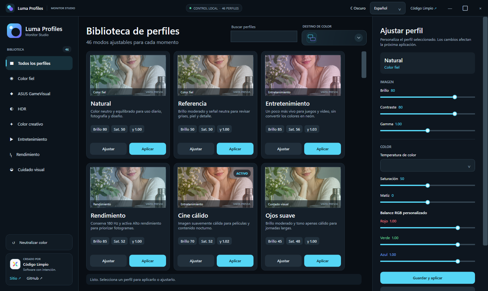

# Luma Profiles

Aplicación creada por **[Código Limpio](https://codigolimpio.com.co/)** · [Repositorio público](https://github.com/CodigoLimpioCo/luma-profiles)

Luma Profiles es una aplicación de escritorio para Windows que permite guardar, personalizar y aplicar perfiles de color a uno o varios monitores compatibles con DDC/CI.



## Funciones

- 50 perfiles ajustables organizados por finalidad, incluidos Blanco y negro, Lectura amarilla y Filtro azul.
- Categoría Gamer con modos Competitivo, Inmersivo, Sombras y Arcade vibrante.
- Favoritos persistentes: marca perfiles con una estrella y encuéntralos en su propia categoría.
- Siete modos inspirados en ASUS GameVisual: RTS/RPG, FPS, Cine, Escenario, Carrera, sRGB y MOBA.
- Cinco perfiles HDR para juegos, cine, consola, habitaciones luminosas y salas oscuras.
- Diez estilos creativos, desde Piel natural y Monocromo editorial hasta Bosque profundo y Cyber nocturno.
- Veinte perfiles adicionales para fotografía, diseño, impresión, HDR, anime, deportes, documentales, eSports, estilos creativos y comodidad visual.
- Natural, Referencia, Entretenimiento, Rendimiento, Cine cálido y tres niveles de cuidado visual.
- Tarjetas con vista previa, descripción y valores principales.
- Categorías para color fiel, entretenimiento, rendimiento y cuidado visual.
- Ajuste individual de brillo, contraste, gamma, temperatura de color, saturación, matiz y balance RGB.
- Temas claro y oscuro, tarjetas fotográficas, tres columnas y editor dividido en Imagen y Color.
- Interfaz disponible en español, inglés y portugués.
- Idiomas extensibles mediante archivos de texto plano `.lang`, sin modificar el código de la aplicación.
- Aplicación a ambas pantallas o a una pantalla específica.
- Guardado de personalizaciones en `%LOCALAPPDATA%\LumaProfiles\profiles.json`.
- Botón para recuperar una señal RGB neutra cuando aparece una dominante de color.
- Cambio opcional al plan de energía Alto rendimiento.

## Requisitos

- Windows 10 u 11.
- .NET Desktop Runtime 10.
- Monitor con DDC/CI habilitado para controlar brillo, contraste y saturación.

La corrección de gamma funciona mediante las API de Windows. Algunos controladores gráficos, perfiles ICC o aplicaciones de calibración pueden reemplazarla posteriormente.

El control de matiz depende del modo GameVisual y del soporte DDC/CI del monitor. Cuando el propio monitor lo bloquea, Luma Profiles conserva el resto de los ajustes y muestra un aviso.

## Ejecutar desde el código

```powershell
dotnet run --project .\src\LumaProfiles\LumaProfiles.csproj
```

## Compilar

```powershell
dotnet build .\src\LumaProfiles\LumaProfiles.csproj -c Release
```

## Agregar un idioma

1. Copia uno de los archivos de `src/LumaProfiles/Locales`.
2. Cambia `meta.code` y `meta.name`.
3. Traduce los valores ubicados después del signo `=` sin alterar las claves.
4. Compila o copia el archivo a la carpeta `Locales` junto al ejecutable y reinicia la aplicación.

El selector descubre automáticamente todos los archivos `.lang` válidos.

## Seguridad y precisión de color

Luma Profiles no instala controladores ni necesita privilegios de administrador. Para trabajo donde la precisión sea crítica se recomienda utilizar un colorímetro y un perfil ICC medido para cada panel. Los modos cálidos se ofrecen por comodidad; no constituyen tratamiento médico.

## Diseño

Las capturas de los temas oscuro, claro y de la ventana maximizada se encuentran en `docs`. El concepto visual inicial está conservado en `docs/design-concept.png`.

## Licencia

MIT. Las contribuciones y mejoras son bienvenidas.

Código Limpio no está afiliado con ASUS. Las marcas mencionadas pertenecen a sus respectivos propietarios.
