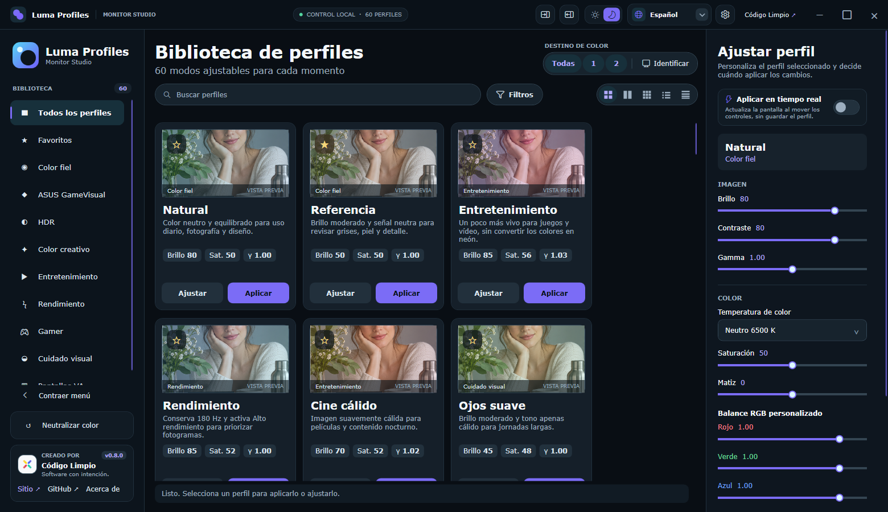
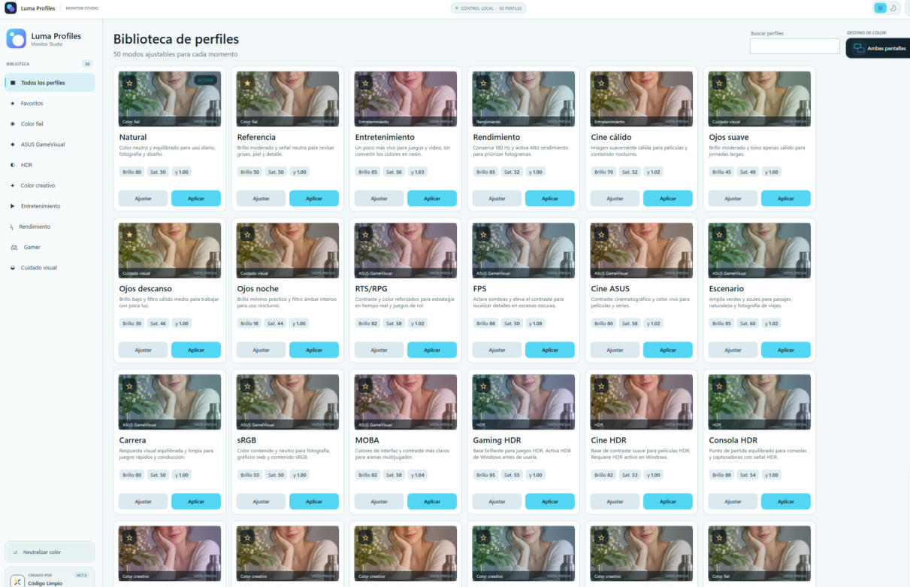
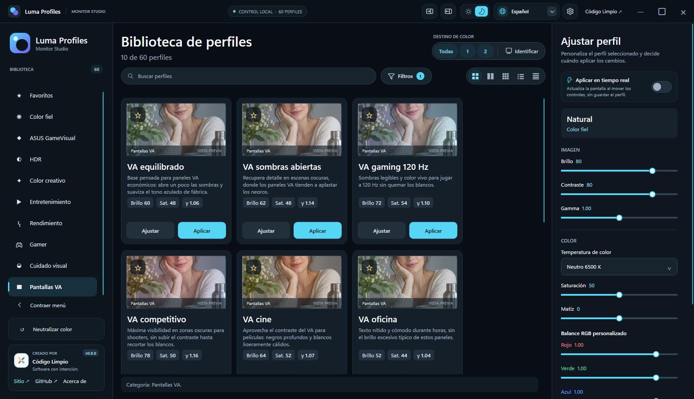

# Luma Profiles

Aplicación creada por **[Código Limpio](https://codigolimpio.com.co/)** · [Repositorio público](https://github.com/CodigoLimpioCo/luma-profiles)

Luma Profiles es una aplicación de escritorio para Windows que permite guardar, personalizar y aplicar perfiles de color a uno o varios monitores compatibles con DDC/CI.

[](https://apps.microsoft.com/detail/9PJRZB8HFCSN)  



| Tema claro | Pantallas VA |
| --- | --- |
|  |  |

## Instalación

- **Microsoft Store:** [Luma Profiles](https://apps.microsoft.com/detail/9PJRZB8HFCSN).
- **Release en GitHub:** descarga el ejecutable o el ZIP desde [Releases](https://github.com/CodigoLimpioCo/luma-profiles/releases).
- **Desde el código:** consulta [Ejecutar desde el código](#ejecutar-desde-el-código).

## Funciones

### Perfiles
- 60 perfiles ajustables por finalidad: color fiel, entretenimiento, rendimiento, cuidado visual, HDR, creativos, Gamer, modos inspirados en ASUS GameVisual y diez modos para paneles VA económicos.
- Perfiles personalizados: guarda los valores del panel de ajuste como perfil propio, renómbralo o elimínalo.
- Favoritos persistentes con su propia categoría.
- Buscador avanzado (sin distinguir mayúsculas ni acentos) con filtros combinables y orden.
- Cinco vistas: tarjetas, tarjetas grandes, mosaico, lista y detalles.
- Vista previa antes/después al pasar el ratón sobre una tarjeta, sin tocar el monitor, y vista previa en tiempo real al ajustar.

### Ajuste y monitores
- Brillo, contraste, gamma, temperatura de color, saturación, matiz y balance RGB.
- Aplicación a todas las pantallas o a las que elijas, con botón «Identificar».
- Control DDC/CI opcional: apagado, solo se usa corrección por software.
- Botón para neutralizar una dominante de color y cambio opcional al plan de energía Alto rendimiento.

### Seguridad
- Confirmación «¿Conservar los cambios?» con reversión automática a los 30 s, también para atajos y bandeja (tarjeta pequeña siempre visible).
- Punto de restauración guardado antes del primer cambio, con archivo de respaldo propio.
- Los perfiles nunca escriben ganancias RGB ni nitidez en el monitor.

### Automatización
- Horario con tramos múltiples, amanecer/atardecer automáticos y transición suave.
- Perfiles por aplicación en primer plano.
- Atajos globales: Ctrl+Alt+→/←/0 y Ctrl+Alt + tecla por perfil.
- Icono en la bandeja, inicio con Windows en segundo plano e instancia única.

### Personalización
- Tema claro, oscuro o del sistema; 17 colores de acento y color propio.
- Tipo de letra y tamaño de la interfaz configurables, menú lateral ajustable.
- Español, inglés y portugués; idiomas extensibles con archivos `.lang`.
- Exportación e importación de perfiles, horario, reglas y atajos.

El historial completo está en [CHANGELOG.md](CHANGELOG.md).

## Requisitos

- Windows 10 (2004, compilación 19041) o Windows 11.
- .NET Desktop Runtime 10 (la versión de Microsoft Store lo gestiona sola).
- Monitor con DDC/CI habilitado para controlar brillo, contraste y saturación.

La corrección de gamma funciona mediante las API de Windows. Algunos controladores gráficos, perfiles ICC o aplicaciones de calibración pueden reemplazarla posteriormente.

El control de matiz depende del modo GameVisual y del soporte DDC/CI del monitor. Cuando el propio monitor lo bloquea, Luma Profiles conserva el resto de los ajustes y muestra un aviso.

## Ejecutar desde el código

```powershell
dotnet run --project .\src\LumaProfiles\LumaProfiles.csproj
```

## Pruebas

```powershell
dotnet test .\LumaProfiles.sln
```

## Compilar

```powershell
dotnet build .\src\LumaProfiles\LumaProfiles.csproj -c Release
```

Para generar el ejecutable y el ZIP de publicación, usa `scripts/release.ps1`.

## Agregar un idioma

1. Copia uno de los archivos de `src/LumaProfiles/Locales`.
2. Cambia `meta.code` y `meta.name`.
3. Traduce los valores ubicados después del signo `=` sin alterar las claves.
4. Compila o copia el archivo a la carpeta `Locales` junto al ejecutable y reinicia la aplicación.

El selector descubre automáticamente todos los archivos `.lang` válidos.

## Seguridad y precisión de color

Luma Profiles no instala controladores ni necesita privilegios de administrador. Para trabajo donde la precisión sea crítica se recomienda utilizar un colorímetro y un perfil ICC medido para cada panel. Los modos cálidos se ofrecen por comodidad; no constituyen tratamiento médico.

## Diseño

Las capturas se encuentran en `docs` y `store-assets`. El concepto visual inicial está en `docs/design-concept.png`. La estructura del código se describe en [docs/ARCHITECTURE.md](docs/ARCHITECTURE.md).

## Microsoft Store

La guía de publicación, el manifiesto MSIX y el comando para generar `.msix`/`.msixupload` están en [docs/MICROSOFT-STORE.md](docs/MICROSOFT-STORE.md). Los recursos de marca para la ficha se encuentran en `store-assets/`.

## Licencia

MIT. Las contribuciones y mejoras son bienvenidas; consulta [CONTRIBUTING.md](CONTRIBUTING.md).

Código Limpio no está afiliado con ASUS. Las marcas mencionadas pertenecen a sus respectivos propietarios.
